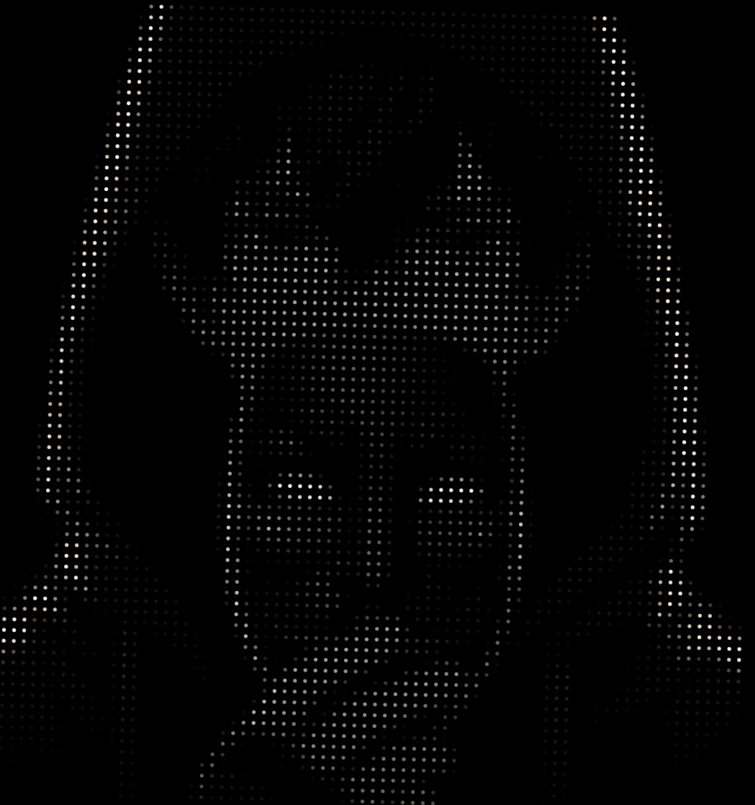

# Exemplos de Imagens do TextoPixelado

Esta pasta contém exemplos de imagens e suas representações textuais geradas pelo **TextoPixelado**.

## Arquivos de Exemplo

### Imagem Original

- 
  - Esta é a imagem original usada como exemplo.

### Representação Textual

- [imagem1.txt](imagem1.txt)
  - Este arquivo contém a representação textual da imagem `imagem1.jpg`, gerada pelo script **TextoPixelado**.

## Como Funciona

1. **Imagem Original**: A imagem `imagem1.jpg` é exibida acima.
2. **Representação Textual**: O arquivo `imagem1.txt` mostra a conversão da imagem em texto com caracteres ASCII.

Você pode visualizar os arquivos diretamente nesta pasta para entender como o **TextoPixelado** converte imagens em representações textuais.
